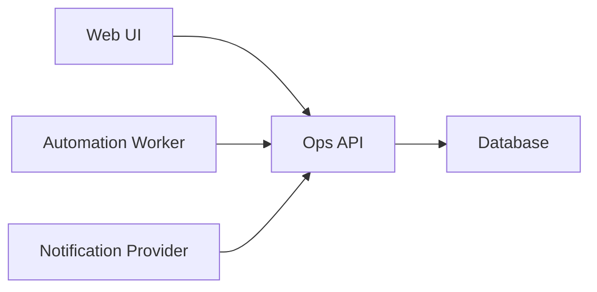

# Ops UI Architecture

This document describes a public-safe reference architecture for an operations dashboard.

## Overview

Ops UI can sit in front of several private services:

- A backend API for operational data
- A database or managed backend for persistence
- Optional automation workers for scheduled checks
- Optional notification integrations for alerts

The public repository should describe integration points without exposing production service names, real domains, database identifiers, bot identifiers, team structure, or private workflows.

## Data Flow

## Public-Safe Boundaries

- Store credentials only in local environment variables or a secret manager.
- Keep production URLs out of docs, examples, tests, and comments.
- Keep private schedules, team names, personal workflows, and internal operational topology out of public documentation.
- Keep implementation docs high-level unless the details are safe for public readers.

## Example Services

Use placeholders in examples:

- API: `https://your-ops-api.example.com`
- Automation service: `https://your-hermes.example.com`
- Supabase: `https://your-project.supabase.co`
